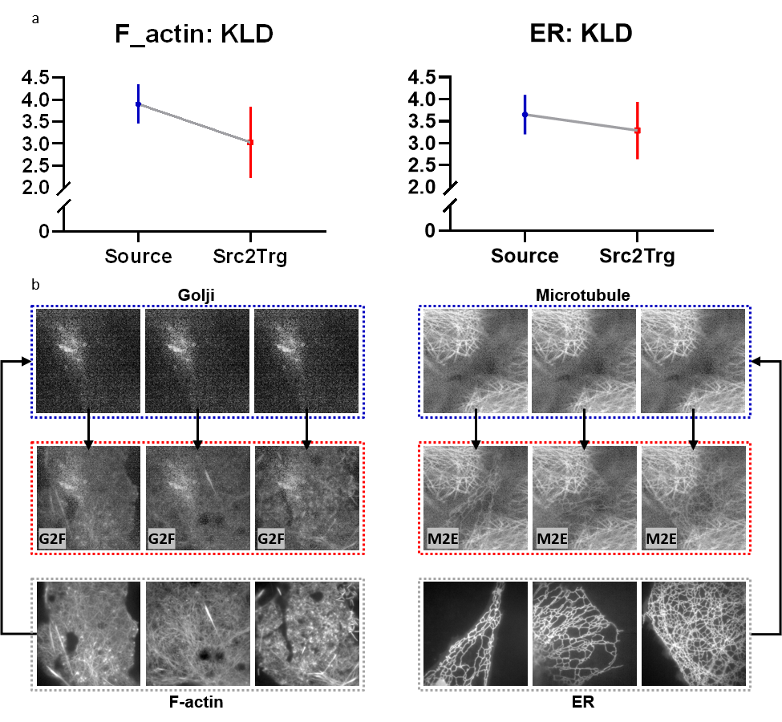

# Hitchlearning: A general free-lunch paradigm for single-image enhancement by unifying inference and training

 

<!-- **Authors:** -->
<!-- **_¹  [Jiaxin Liu](https://Liujiaxin-1.github.io/)_** -->

<!-- **Affiliations:** -->

<!-- _¹ Tsinghua University_ -->

 

Welcome to the official GitHub repository of **HitchLearning**, an innovative Deep Learning (DL) paradigm that revolutionizes the traditional approach by merging training and inference into a cohesive process.

#### 📰 <a href="https://xxx" style="color: black; text-decoration: underline;text-decoration-style: dotted;">Paper</a>     :building_construction: <a href="https://xxx" style="color: black; text-decoration: underline;text-decoration-style: dotted;">Model (via Google)</a>    :building_construction: <a href="https://xxx" style="color: black; text-decoration: underline;text-decoration-style: dotted;">Model (via Baidu)</a>    :card_file_box: <a href="https://xxx" style="color: black; text-decoration: underline;text-decoration-style: dotted;">Dataset</a>    :bricks: [Code](#usage)    :monocle_face: Video    :technologist: Demo    

## Table of Contents 📚

- [Introduction](#introduction)
- [Key Features](#key-features)
- [Architecture](#architecture)
- [Installation](#installation)
- [Usage](#usage)
- [Future Work and Contributions](#future-work-and-contributions)

## Introduction 

  

HitchLearning is not just another DL methodology. It's a groundbreaking approach that challenges the conventional separation of training and inference found in traditional DL paradigms. The core innovation of HitchLearning lies in its rejection of the assumption that training and inference data are independently and identically distributed (i.i.d.).

## Key Features

- **Unified Training and Inference:** HitchLearning uniquely optimizes the model using a single inference image, thereby unifying the process of training and inference. This method addresses the non-i.i.d problem inherent in many DL applications.
- **Real-Time Adaptation:** By focusing on each specific inference image, HitchLearning adapts in real-time to its unique characteristics, offering a significant improvement in model performance.
- **Efficient and Effective:** This paradigm improves model performance in a 'free-lunch' manner, as it requires no additional data other than the single inference image for optimization.
- **Extensive Evaluation:** HitchLearning has been rigorously tested across three different tasks - denoising, deblurring, and super-resolution. It has shown remarkable results in both supervised and unsupervised models across four diverse datasets.

## Architecture

  

## Installation

## Usage
### More details are coming soon!

<!-- ## Why HitchLearning?

- **Enhanced Performance:** Demonstrates superior performance over traditional DL paradigms, setting new benchmarks in various tasks.
- **Generality and Efficacy:** The improvements are consistent across different tasks, models, and datasets, highlighting the generality and efficacy of HitchLearning.
- **Innovative Approach:** Represents a significant leap in applying DL to imaging techniques, filling a crucial gap in current methodologies.

## Contributions

We welcome contributions from the community. If you have ideas, bug reports, or enhancements, please feel free to open an issue or submit a pull request.

## Acknowledgments

Our team extends heartfelt thanks to all contributors and researchers who have made this project possible. We're excited to see how HitchLearning will empower developers and researchers in the field of deep learning.

Stay tuned for updates, and happy coding!

---

For more information, please refer to our [Documentation](#documentation) or contact us directly.-->
